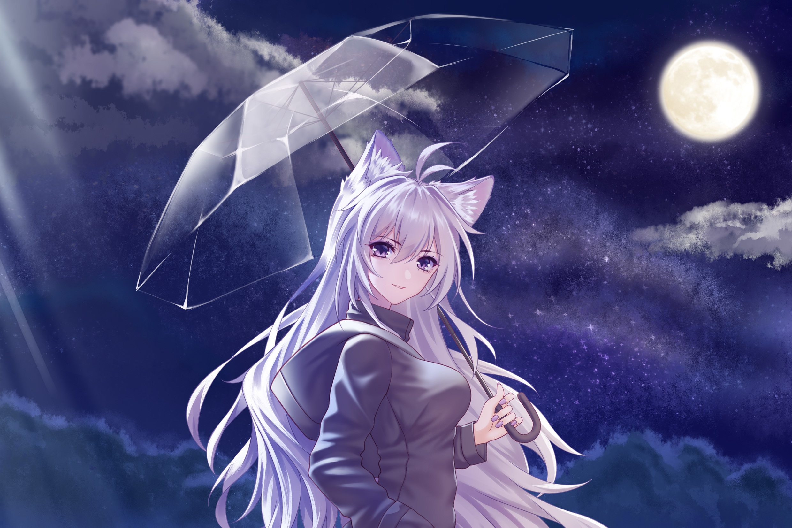

# Wallpaper Archive for Linux Window Managers & Desktops

A collection of high-quality wallpapers suitable for all major Linux window managers and desktop environments. These backgrounds are curated to complement dynamic tiling, modern aesthetics, and to enhance the overall desktop experience—whether you're using Hyprland, Sway, i3, GNOME, KDE Plasma, XFCE, or any other environment.

## About

This repository contains handpicked wallpapers that work beautifully across a wide range of setups. While many are optimized for minimal, sleek configurations (such as Hyprland), they are equally at home on desktops and window managers of all kinds.

## Contents

- High-resolution backgrounds (minimum 1920x1080)
- Various themes and styles
- Suitable for transparency and blur effects if your environment supports them

## Wallpaper Previews

> All wallpapers are at least 1920x1080. Scroll down to see them all!

### Static Wallpapers

<p align="center">

 
  
  
  
  
  
  
  
  
  
  
  
  
  
  
  
  
  
  
  
  
  
  
  
  
  
  
  
  
  
  
  
  
  
  
  
  
  
  
  
  
  
  
  
  
  
  
  
  
  
  
  
  
  
  
  
  
  
  
  
  
  
  
  
  
  
  
  
  
  
  
  
  
  
  
  
  
  
  
  
  
  
  
  
  
  
  
  
  
  
  
  
  
  
  
  
  
  
  
  
  
  
  
  
  
  
  
  
  
  
  
  
  
  
  
  
  
  
  
  
  
  
  
  
  
  
  
  
  
  
  
  
  
  
  
  
  
  
  
  
  
  
  
  
  
  
  
  
  
  
  
  
  
  
  
  
  
  
  
  
  
  
  
  
  
  
  
  
  
  
  
  
  
  
  
  
  
  
  
  
  
 
 
 
 
 
 
 
 
 
 
 


</p>

---

### Dynamic Wallpapers

**Note:** Dynamic wallpapers (.mp4, .webm) cannot be previewed directly in GitHub. Please browse the `Dynamic-Wallpapers/` folder to see the available animated wallpapers.

## Organization

Wallpapers are organized by their type:

- `Dynamic-Wallpapers/` — Contains all the dynamic wallpapers
- `Static-Wallpapers/` — Contains all the static wallpapers

## Usage

Clone this repository to your local machine:

```bash
git clone https://github.com/santoshxshrestha/wallpaper-archive.git
```

### How to Set Wallpapers

Below are examples for popular Linux window managers and desktop environments. Replace `/path/to/wallpaper-archive/your-wallpaper.jpg` with your chosen wallpaper.

#### Hyprland

Add to your configuration file (`~/.config/hypr/hyprland.conf`):

```
exec-once = swaybg -i /path/to/wallpaper-archive/your-wallpaper.jpg
```

Or, with Hyprpaper:

```
preload = ~/path/to/wallpaper-archive/your-wallpaper.jpg
wallpaper = , ~/path/to/wallpaper-archive/your-wallpaper.jpg
```

#### Sway

```
exec-once = swaybg -i /path/to/wallpaper-archive/your-wallpaper.jpg
```

#### i3 / dwm / Openbox (using feh)

```
feh --bg-scale /path/to/wallpaper-archive/your-wallpaper.jpg
```

#### GNOME

Right-click the desktop and select "Change Background", then browse to the cloned folder and select a wallpaper.
Or, from the terminal:

```
gsettings set org.gnome.desktop.background picture-uri "file:///path/to/wallpaper-archive/your-wallpaper.jpg"
```

#### KDE Plasma

- Right-click the desktop → "Configure Desktop and Wallpaper" → Add Image → Select from the wallpaper-archive.

#### XFCE

- Right-click desktop → "Desktop Settings" → Add → Browse to wallpaper-archive.

#### Cinnamon, LXQt, MATE, etc.

- Use the standard desktop settings dialog to browse to the wallpaper-archive and pick your image.

#### For Dynamic Wallpapers

For environments that support dynamic wallpapers, you can use `mpvpaper`:

```
mpvpaper -s -o "no-audio loop" eDP-1 ~/path/to/wallpaper-archive/your-wallpaper.mp4
```

_If your environment isn’t listed here, please open an issue or PR with setup instructions!_

## Contributing

Contributions are welcome! If you'd like to add wallpapers:

1. Fork this repository
2. Add your wallpapers (1920x1080 minimum resolution)
3. Create a pull request

## License

This is a curated archive of wallpapers collected from various open sources and repositories.
All wallpapers belong to their original creators. This archive does not claim ownership of any content.
Please respect the original creators of the wallpapers. This collection is for personal use only.

> Usage: Personal use only. Do not redistribute or use for commercial purposes without permission from the original author.
> If you're a creator and would like your artwork removed or credited, please open an issue.
